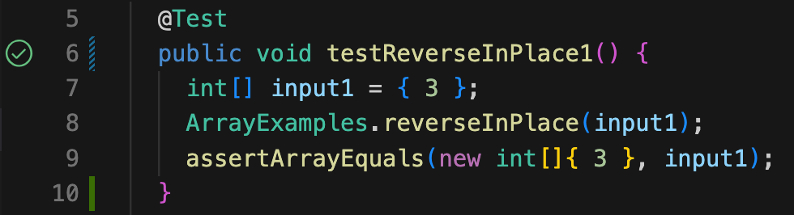
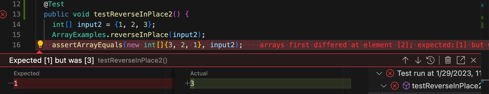

## LAB REPORT 2
Three parts will be introduced in this report.
1. String Server
2. Bug from Lab 3
3. Conclusion

---

### PART 1: String Server

Below is my implemantation for `StringServer`.

``` Java
import java.io.IOException;
import java.net.URI;

class Handler implements URLHandler {

    String dialogue = "";

    public String handleRequest(URI url) {
        if (url.getPath().equals("/")) {
            return String.format("It's an empty path.");
        } else {
            if (url.getPath().contains("/add-message")) {
                String[] parameters = url.getQuery().split("=");
                if (parameters[0].equals("s")) {
                    dialogue += "\n" + parameters[1];
                    return dialogue;
                }
            }
            return "404 Not Found!";
        }
    }
}

class StringServer {
    public static void main(String[] args) throws IOException {
        if(args.length == 0){
            System.out.println("Missing port number! Try any number between 1024 to 49151");
            return;
        }

        int port = Integer.parseInt(args[0]);

        Server.start(port, new Handler());
    }
}
```

Below are my two screenshots of using `add-message`.


> At this moment, firstly inside `handleRequest()` method, `getPath()` was called, the output of the method is `"/add-message?s=Rachel: Everyone, this is my sister."`. Since the output contains `"/add-message"`, `getQuery()` was called to get the query part of the url, which is `"s=Rachel: Everyone, this is my sister."`. 
> 
> Then `split()` method was called with argument `"="`. The query was splited into two String segments, `"s"` and `"Rachel: Everyone, this is my sister."`. Both segments were stored in the String array `"parameters"`, at indexes `[0]` and `[1]` respectively. Later on, the program added the main message stored at `parameters[1]` to the String `dialogue`, with `"\n"` in front. 
> 
> Finally, `handleRequest()` returned `dialogue` which currently contains the first message. Woo-hoo!


> At this moment, firstly inside `handleRequest()` method, `getPath()` was called, the output of the method is `"/add-message?s=Joey: How you doin'"`. Since the output contains `"/add-message"`, `getQuery()` was called to get the query part of the url, which is `"s=Joey: How you doin'"`. 
> 
> Then `split()` method was called with argument `"="`. The query was splited into two String segments, `"s"` and `"s=Joey: How you doin'"`. Both segments were stored in the String array `"parameters"`, at indexes `[0]` and `[1]` respectively. Later on, the program added the main message stored at `parameters[1]` to the String `dialogue`, with `"\n"` in front. 
> 
> Note that `dialogue` also contains the last message, it should look like this:
> 
> `"\nRachel: Everyone, this is my sister.\nJoey: How you doin'"`
> 
> Finally, `handleRequest()` returned `dialogue` which currently contains the first message. Yah-hah!

---

### PART 2: Bug from Lab 3

For `ArrayExamples.java`'s `reverseInPlace()` method, one example of failure-inducing input could be:

``` Java
@Test 
public void testReverseInPlace() {
    int[] input = {1, 2, 3};
    ArrayExamples.reverseInPlace(input);
    assertArrayEquals(new int[]{3, 2, 1}, input);
}
```
For the same method, one example of non-failure-inducing input could be:

``` Java
@Test 
public void testReverseInPlace() {
    int[] input = {1};
    ArrayExamples.reverseInPlace(input);
    assertArrayEquals(new int[]{1}, input);
}
```
The symptom, as the output of running the tests:



Below are `reverseInPlace()` before and after the fix.

``` Java
// BEFORE
static void reverseInPlace(int[] arr) {
    for(int i = 0; i < arr.length; i += 1) {
        arr[i] = arr[arr.length - i - 1];
    }
}
```

``` Java
// AFTER
static void reverseInPlace(int[] arr) {
    int[] newArray = new int[arr.length];
    for(int i = 0; i < arr.length; i += 1) {
        newArray[i] = arr[arr.length - i - 1];
    }
    for (int i = 0; i < arr.length; i += 1){
        arr[i] = newArray[i];
    }
}
```
In the fix, I created a new temperary array to store the change of the original array instead of making changes directly in the original array. This effectively avoided that the second half of the original array wasn't updated.

---

### PART 3: Conclusion

A lot of things have been learned in the past two weeks. I got to host a local server for the first time, even though it was with a highly-completed template. I didn't know that by changing URL we are able to interact with people who are also visiting the local server. It gave me some clues how people at the beginning of the internet era connect with each other. 
