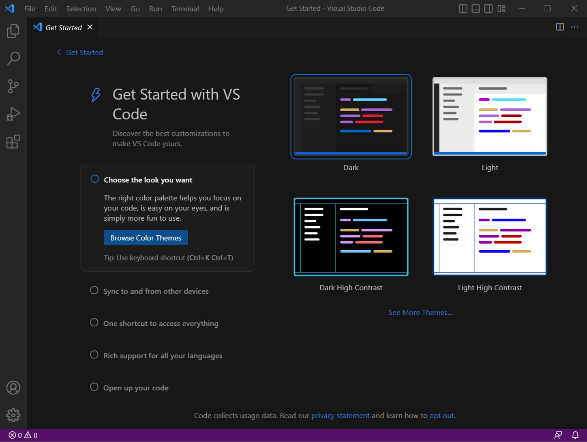
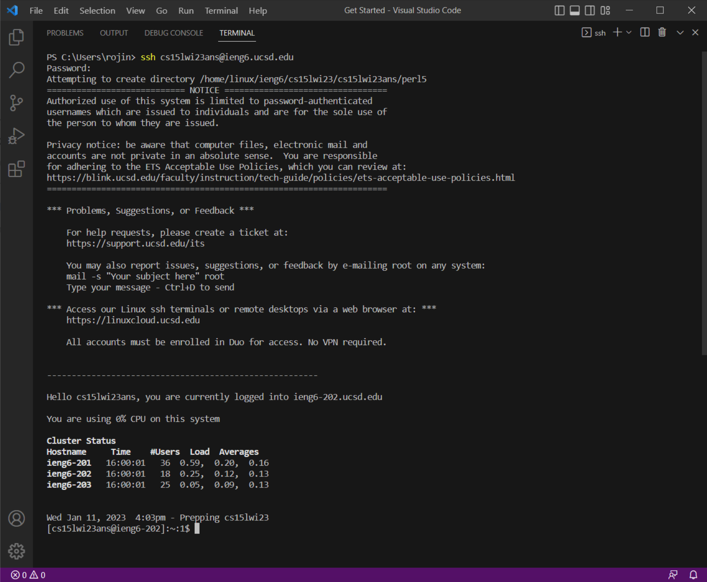
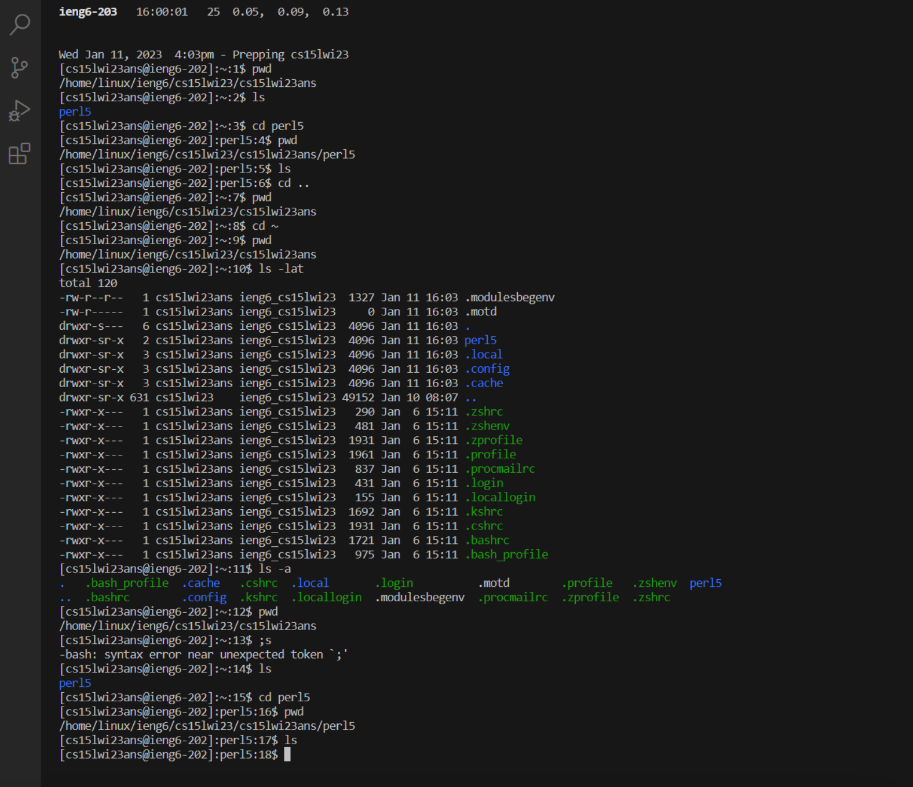

# HOW TO REMOTE ACCESS?
This tutorial will cover 3 steps for students to understand remote access:
* Installing VScode
* Remotely connecting
* Trying some cammands

## Installing VScode
The latest version of VScode could be found here: [link](https://code.visualstudio.com/). VS Code is a free code editor made by Microsoft. It helps you write and organize your code easily and has features like code highlighting, finding mistakes, and auto-suggestions to make your coding experience better.

After downloading and installing VScode following the instructions on the website, open it on your end.
It would be like this:



## Remotely Connecting
In order to remote access to the server, you will need a course-specific account. You may look up yours here: [link](https://sdacs.ucsd.edu/~icc/index.php).

Your account username should be something like this: **cs15lwi23**** *(let ** to be whatever letters you have, same below)*.

First, we use `ssh` command in the terminal in VScode, you may find terminal on the menu bar.

In the terminal, type out:

`$ ssh cs15lwi23**@ieng6.ucsd.edu` (The dollar sign $ was already there! Do not type yourself.)

If it's your first time connnecting to the server, you will see a message like this:

```
⤇ ssh cs15lwi23zz@ieng6.ucsd.edu
The authenticity of host 'ieng6.ucsd.edu (128.54.70.227)' can't be established.
RSA key fingerprint is SHA256:ksruYwhnYH+sySHnHAtLUHngrPEyZTDl/1x99wUQcec.
Are you sure you want to continue connecting (yes/no/[fingerprint])?
```

Type `yes` so you may continue.

Then it will prompt you to enter the password.

After that, you are successfully logged in to the server!



## Trying some commands
As you are connecting to the server, try some commands.

Try to use commands like `cd`, `ls`, `pwd` to explore the file system like this:



```
cd - lets you move between folders in the computer's file system by just typing "cd" followed by the name of the folder you want to go to.
ls - lists the files and folders in the current working directory.
pwd - shows you the full path of the current directory you are in.
```

*This is the end of the tutorial.*
